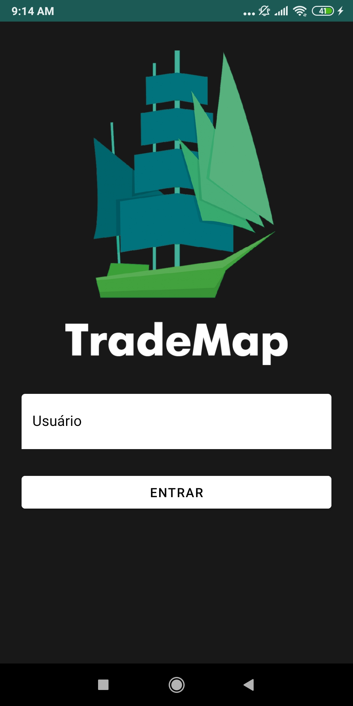
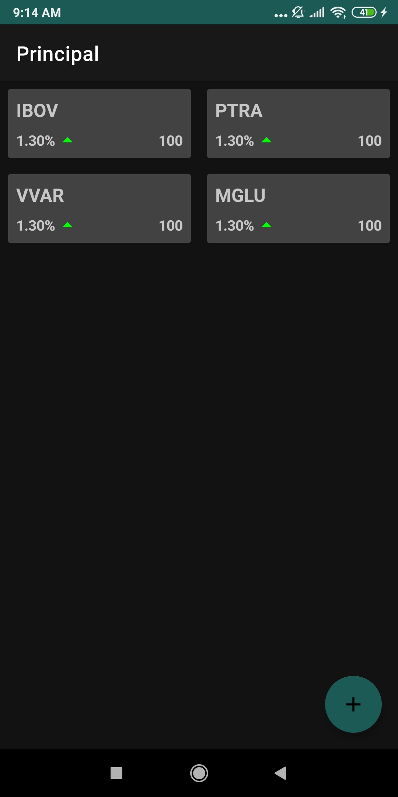
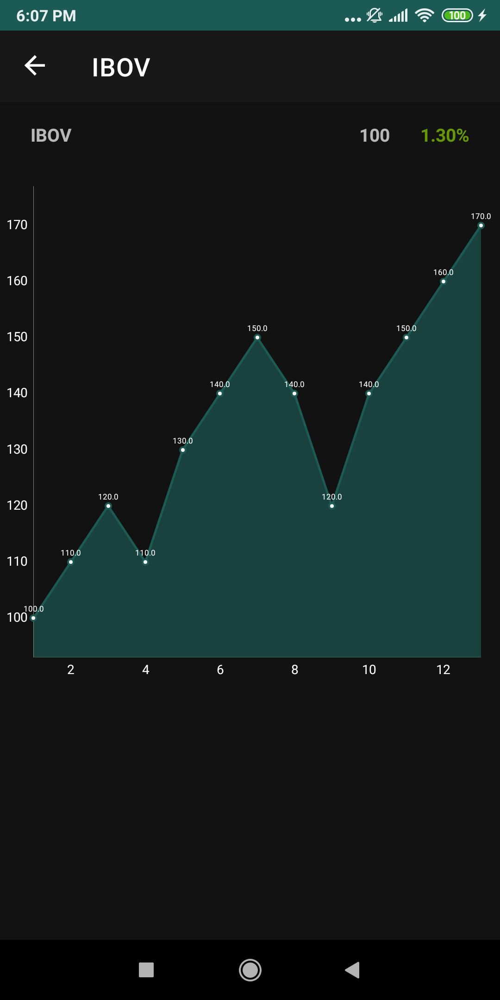

# TradeMap Clone 

Realização de um APP que simula atualização da bolsa de valores em tempo real (um clone do TradeMap) realizado com a linguagem Kotlin seguindo um Lab da Digital Innovation One. 

O aplicativo foi criado seguindo a arquitetura MVVM (recomendada pelo Google), além da utilização de outras tecnologias, como:

    MQTT;
    Retrofit2;
    ViewModel;
    LiveData;
    Courotines;
    Koin;
    Navigation;
    Room.

A API utilizada foi produzida por outro Lab (outra parte), está disponível no repositório: https://github.com/cicerojmm/tradeMapCloneMentoriaDIO

<h3>Como o aplicativo ficou: </h3>

